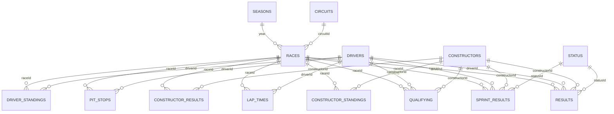

# Sector 4 — Data Report

**Phase:** 1 (Kaggle dataset analysis) · **Generated:** 2026-09-21
**Source under analysis:** Kaggle "Formula 1 World Championship (1950-2024)" (Vopani) — an Ergast API dump, files dated 2025-01-29.

---

## Summary

The Kaggle dump is **in much better shape than expected**. Three headline findings:

1. **2024 is complete, not cut off.** All 24 rounds are present in every table, ending with the Abu Dhabi Grand Prix on 2024-12-08. The final 2024 driver and constructor standings match [formula1.com](https://www.formula1.com/en/results/2024/drivers) **exactly** — all 24 drivers and all 10 teams, positions and points. So the "last updated ~2 years ago" note on the Kaggle page reflects the upload date, not truncated content.
2. **Structural integrity is perfect.** Every primary key is unique, **zero** foreign keys are orphaned across all 23 relationships, there are no duplicate `(year, round)` pairs, no gaps in round numbering in any season, and no race without results.
3. **Standings reconcile exactly for the modern era.** Recomputing driver standings from `results` + `sprint_results` reproduces `driver_standings` for **every one of the 14,398 snapshots from 1991 to 2024** with zero mismatches, and the `wins` column matches on all 34,863 rows across all eras. Pre-1991 mismatches are fully explained by the dropped-scores rule (confirmed empirically, not assumed). Every modern constructor discrepancy is a real championship penalty.

The gap to fill is therefore **not** 2024 — it is **2025 and 2026-to-date**, which are absent entirely. `seasons.csv` stops at 2024.

There are **8 genuine data issues**, all catalogued in [Issues](#issues-and-how-id-handle-each). Only one touches the modern era materially: a corrupted winner time in the 2024 Belgian Grand Prix. Nothing here required guessing or filling a value.

### Coverage at a glance

| Table | Rows | Seasons | Races covered | Last race present |
|---|---:|---|---:|---|
| `results` | 26,759 | 1950–2024 | 1,125 | 2024 R24 Abu Dhabi (2024-12-08) |
| `driver_standings` | 34,863 | 1950–2024 | 1,125 | 2024 R24 Abu Dhabi |
| `constructor_standings` | 13,391 | 1958–2024 | 1,061 | 2024 R24 Abu Dhabi |
| `constructor_results` | 12,625 | 1958–2024 | 1,060 | 2024 R24 Abu Dhabi |
| `qualifying` | 10,494 | 1994–2024 | 494 | 2024 R24 Abu Dhabi |
| `lap_times` | 589,081 | 1996–2024 | 544 | 2024 R24 Abu Dhabi |
| `pit_stops` | 11,371 | 2011–2024 | 285 | 2024 R24 Abu Dhabi |
| `sprint_results` | 360 | 2021–2024 | 18 | 2024 R23 Qatar (2024-12-01) |
| `races` | 1,125 | 1950–2024 | — | 2024 R24 Abu Dhabi |
| `seasons` | 75 | 1950–2024 | — | 2024 |
| `drivers` | 861 | — | — | — |
| `constructors` | 212 | — | — | — |
| `circuits` | 77 | — | — | — |
| `status` | 139 | — | — | — |

`sprint_results` ending at R23 is correct — Qatar was the last 2024 sprint; Abu Dhabi had none. All 18 scheduled sprints (2021–2024) have results, and there are no sprint results for races without a sprint.

---

## Table-by-table breakdown

Loaded with `\N` as the **only** null token (`keep_default_na=False`), so a genuinely empty field would stay visible as an empty string rather than silently becoming null. None were found.

### `races` — 1,125 × 18 · PK `raceId` ✅ unique
| Column | Dtype | Null % |
|---|---|---:|
| `raceId`, `year`, `round`, `circuitId` | int64 | 0.00 |
| `name`, `date`, `url` | str | 0.00 |
| `time` | str | 64.98 |
| `fp1_date`, `fp2_date`, `quali_date` | str | 92.00 |
| `fp1_time`, `fp2_time`, `quali_time` | str | 93.96 |
| `fp3_date` / `fp3_time` | str | 93.60 / 95.29 |
| `sprint_date` / `sprint_time` | str | 98.40 / 98.67 |

Session date/time columns only populate from 2021 onward. `date` is the local race date; `time` is the UTC start time (Ergast convention — **to be re-confirmed against the Jolpica docs in Part 2 rather than assumed**).

### `results` — 26,759 × 18 · PK `resultId` ✅ unique
| Column | Dtype | Null % | Note |
|---|---|---:|---|
| `resultId`, `raceId`, `driverId`, `constructorId`, `grid`, `positionOrder`, `laps`, `statusId` | int64 | 0.00 | |
| `points` | float64 | 0.00 | |
| `positionText` | str | 0.00 | always populated |
| `position` | float64 | **40.93** | null ⇔ not in the official classification |
| `number` | float64 | 0.02 | 6 rows |
| `time` / `milliseconds` | str / float64 | 71.30 | only classified finishers on the lead lap |
| `fastestLap`, `fastestLapTime`, `fastestLapSpeed` | — | 69.16 | 2004+ only |
| `rank` | float64 | 68.20 | |

⚠️ **`(raceId, driverId)` is NOT unique** — 176 rows across 42 races share one (shared drives, 1950–1964, plus one 1978 oddity). Any join on that pair will fan out. Use `resultId`.

### `driver_standings` — 34,863 × 7 · PK `driverStandingsId` ✅ unique
No nulls in any column. Cumulative snapshot **after** each race (see [Leakage](#leakage-warning-for-modelling)).

### `constructor_standings` — 13,391 × 7 · PK `constructorStandingsId` ✅ unique
No nulls. Same post-race snapshot semantics.

### `constructor_results` — 12,625 × 5 · PK `constructorResultsId` ✅ unique
`status` is 99.87% null; the 17 non-null values are all `"D"` and all 2007 McLaren (spygate). Points scored **on track**, before championship penalties.

### `lap_times` — 589,081 × 6 · PK `(raceId, driverId, lap)` ✅ unique
No nulls anywhere. `time` and `milliseconds` agree on **every single row** (max difference 0 ms).

### `pit_stops` — 11,371 × 7 · PK `(raceId, driverId, stop)` ✅ unique
No nulls. `duration` and `milliseconds` agree exactly on all rows.

### `qualifying` — 10,494 × 9 · PK `qualifyId` ✅ unique
`q1` 1.49% null, `q2` 44.07%, `q3` 64.98% — expected, since only 15 and 10 drivers reach Q2/Q3 in the knockout era.

### `sprint_results` — 360 × 16 · PK `resultId` ✅ unique
`position` 4.17% null, `time`/`milliseconds` 5.56%, `fastestLap`/`fastestLapTime` 2.50%.

### `drivers` — 861 × 9 · PK `driverId` ✅ unique
`number` 93.15% null and `code` 87.92% null — permanent numbers and three-letter codes only exist for the modern era. Not a defect.

### `constructors` — 212 × 5 · `circuits` — 77 × 9 · `seasons` — 75 × 2 · `status` — 139 × 2
All PKs unique, no nulls in any column of any of the four.

---

## Relationship diagram

**All 23 foreign-key relationships resolve with zero orphans.**

Three parent rows are never referenced (harmless, not errors):
- `constructors.constructorId = 88` — "Eagle", no `results` rows.
- `status.statusId = 133` (`+49 Laps`) and `134` (`+38 Laps`) — unused status codes.

---

## Consistency checks

### Driver standings recomputation
Recomputed as `sum(results.points) + sum(sprint_results.points)`, cumulative per round, against a dense driver × round grid (so a driver who skips a race keeps their running total).

| Scope | Snapshots | Mismatches |
|---|---:|---:|
| **1991–2024** | 14,398 | **0** ✅ |
| All eras (1950–2024) | 34,863 | 126 (0.36%) |
| End-of-season totals, all eras | 3,211 driver-seasons | 50 |
| `wins` column, all eras | 34,863 | **0** ✅ |

All 50 end-of-season mismatches are in one direction — the naive sum **exceeds** the official total, never falls short. That is the signature of dropped scores, and it is confirmed below rather than assumed.

### Constructor standings recomputation

| Scope | Snapshots | Mismatches |
|---|---:|---:|
| 1991–2024 | — | 25, all in 2007 / 2018 / 2020 (all explained) |
| All eras | 13,391 | 197 |
| `constructor_results` vs sum of `results.points` per team-race, **1980+** | — | **0** ✅ |
| Same check, 1950–1979 | — | 477 (best-car-only rule) |

### Rule quirks found, and how each was handled

| # | Quirk | Evidence found | Handling |
|---|---|---|---|
| 1 | **Dropped scores** (best N of M) | 50 driver-seasons over 1950–67, 1979–80, 1985–90; naive sum always ≥ official | **Confirmed empirically by fitting N**, not assumed. 1988 = best 11 of 16 (Prost 105→87, Senna 94→90 — the season Prost outscored Senna but lost the title); 1990 = best 11 of 16; 1950 = best 4 of 7. Recompute reported as-is with the delta attributed. |
| 2 | **Split-season dropped scores (1979)** | Best-N fits Scheckter (8) but **not** Villeneuve — no single N works | Correctly identified as the half-season rule (best 4 of first 7 + best 4 of last 8), which no single-N model can fit. Flagged, not forced. |
| 3 | **Shared drives** | 228 rows share a `(raceId, positionOrder)` across 46 races, 1950–64. Verified: in race 717 (1964 US GP) driver 373 appears at P7 in his own car **and** at P12 in a shared car | Points already split fractionally in `results.points`. No adjustment needed; documented as the reason `(raceId, driverId)` is not unique. |
| 4 | **Half-points races** | 42 fractional-point rows in exactly 1952–56, 1959, 1975, 1984, 1991, 2009, 2021 | Matches the known half-points races (1975 Spain, 1984 Monaco, 1991 Australia, 2009 Malaysia, 2021 Belgium). Already baked into `results.points`; no adjustment. |
| 5 | **Changing points systems** | — | **No reimplementation needed.** `results.points` stores the points actually awarded per race, so every era's table is already applied. This removes a large class of potential error. |
| 6 | **Fastest-lap bonus point** | — | Also already inside `results.points`. Confirmed by the exact 1991–2024 reconciliation, which spans the 2019–24 bonus-point era. |
| 7 | **Sprint points** | 360 rows, 2021–24, all 18 scheduled sprints | Added to the driver total at the same `raceId`. Reconciles exactly. |
| 8 | **Indy 500 excluded from the Constructors'** | Race 768 (1958 Indy 500) is the sole race in `constructor_standings` with no `constructor_results` rows | Correct behaviour: Indy counted for the Drivers' title 1950–60 but never the Constructors'. Standings carry forward; no constructor points awarded. Not an error. |
| 9 | **Constructors: best car only (pre-1979)** | 477 team-race mismatches, entirely 1950–1979, **zero from 1980 on** | Only the highest-finishing car scored before 1979. `constructor_results` is authoritative; don't derive it by summing `results` for those years. |
| 10 | **2007 McLaren exclusion** | 17 `constructor_results` rows flagged `status='D'` | Ergast places McLaren **last (P11)** but keeps `points = 218`; officially they scored **0**. Inconsistent with how 2018/2020 are handled — see Issue 2. |
| 11 | **2018 Force India** | `constructor_results` 111 vs standings 52 (Δ59) | Real: the team entered administration and forfeited its first-12-race points on re-entry as Racing Point. Ergast reuses one `constructorId` for both. Standings are correct. |
| 12 | **2020 Racing Point** | `constructor_results` 210 vs standings 195 (Δ15) | Real: 15-point deduction for the "pink Mercedes" brake ducts. Standings are correct. |

**Rule of thumb this establishes:** `constructor_results` = points scored on track; `constructor_standings` = championship points after penalties. They diverge in exactly 2007, 2018 and 2020 in the modern era. **Use `constructor_standings` as the championship truth.**

### Ground-truth spot check (2024)
Both verified against formula1.com, full tables, not spot values:
- **Drivers:** all 24 positions and point totals match exactly ✅
- **Constructors:** all 10 positions and point totals match exactly ✅

---

## Issues and how I'd handle each

| # | Severity | Issue | Scope | Proposed handling |
|---|---|---|---|---|
| 1 | **High** | **2024 Belgian GP winner time is corrupt.** Race 1134: Russell won on track then was disqualified for being underweight. Hamilton is classified P1 but his `time` is `+0.526` and `milliseconds` = **526** — a gap, not a total. Russell's row has `time` `1:19:57.040` (4,797,040 ms) but `milliseconds` = 4,797,566 — off by exactly Hamilton's 526 ms gap. | Exactly **1 race** of 1,125. The only race with no absolute winner time; the only absolute-time/ms disagreement in the entire table. | Ask you before touching it. Cleanest fix is to take Jolpica's version of this race in Part 3 and diff. **Do not** derive race-duration features without handling this row, or the 2024 Belgian GP will look like a 0.5-second race. |
| 2 | Medium | **2007 McLaren points inconsistency.** `constructor_standings` shows 218 points at P11; officially McLaren scored **0**. Ergast also applies a temporary 15-point deduction at rounds 11–13 that then disappears. | 1 constructor-season | Flag, don't silently rewrite. Recommend adding a derived `championship_points` column that applies the exclusion, keeping the raw value intact. **Needs your decision.** |
| 3 | Medium | **`results.laps` disagrees with `lap_times` row counts** for 92 driver-races (0.80% of the 11,496 in lap-times coverage). Includes clear **driver-ID swaps**: in race 155 (2001) driver 15 has `laps=0` but 52 lap-time rows while driver 55 has `laps=52` and none — the two are transposed. Same pattern in races 157 and 13. Worst years: 2014 (26), 2010 (19), 2001 (11), 2003 (11). One row in 2024. | 92 driver-races, 1998–2024 | Trust `results.laps` (it reconciles with standings); treat `lap_times` as suspect where they disagree. Diff the 2024 case against Jolpica in Part 3. Flag the rest; **do not** repair the swaps without your sign-off. |
| 4 | Low | **`(raceId, driverId)` not unique in `results`** — 176 rows, 42 races. 1950–64 are legitimate shared drives; the 1978 Italian GP has Harald Ertl entered twice under two different `constructorId`s, both DNQ. | 42 races | Document loudly; use `resultId` as the join key. The 1978 row is a genuine duplicate entry — flag for your call. |
| 5 | Low | **`grid` exceeds the number of classified entrants** for 13 rows (1952, 1953, 1964–67, 1969, 1971, 1985, 1986). | 13 rows | Almost certainly correct-as-recorded: grid slots came from a larger entry list where non-qualifiers were dropped from results. Leave as-is, document. |
| 6 | Low | **`grid = 0` on 1,638 rows** — Ergast's encoding for a pit-lane start or no qualifying time, not a missing value. | 1,638 rows | Not a defect. Must be decoded explicitly before use as a numeric feature, or a pit-lane start will read as pole. |
| 7 | Low | **Red-flag periods recorded as lap times and pit stops.** 626 lap times exceed 10 minutes (race 847, the 2011 Canadian GP, has 2:05:xx "laps" during its 2-hour suspension) and 478 pit stops exceed 5 minutes (race 1083 has ~51-minute lap-1 "stops"). | 626 + 478 rows | Not corruption — the clock keeps running under a red flag. Must be filtered before computing pace features. No pit stop is under 10 s, so there is no implausibly-fast corruption. |
| 8 | Low | **2005 Australian GP: `position` null with a numeric `positionText`** (Button P11, Sato P14). | 2 rows | **Verified as correct encoding**, not a bug: both were classified on track, then withdrawn so BAR could change engines without penalty. `position` = official classification, `positionText` = on-track result. Confirms the rule below. |

### Encoding rules confirmed
`position` is null **exactly** when the driver is not in the official classification. Verified: 0 rows have a non-numeric `positionText` with a non-null `position`, and 0 rows disagree where both are numeric. The 2 exceptions in Issue 8 are withdrawals and are correct.

| `positionText` | Rows | Meaning (dominant statuses) |
|---|---:|---|
| numeric | 15,808 | Classified |
| `R` | 8,897 | Retired (Engine 1,867; Accident 957; Collision 801) |
| `F` | 1,368 | Failed to qualify (DNQ 1,025; DNPQ 331; 107% rule 9) |
| `W` | 336 | Withdrew |
| `N` | 190 | Not classified (insufficient distance) |
| `D` | 151 | Disqualified |
| `E` | 9 | Excluded |

`positionOrder` is a dense 1..N rank in every race except the 46 shared-drive races, where it legitimately ties.

### Time-string parsing
| Field | Format | Agreement with `milliseconds` |
|---|---|---|
| `lap_times.time` | `M:SS.mmm`, and `H:MM:SS.mmm` under red flags | **Exact on all 589,081 rows** |
| `pit_stops.duration` | `SS.mmm` / `M:SS.mmm` | **Exact on all 11,371 rows** |
| `results.time` | `H:MM:SS.mmm` for the winner, `+S.mmm` / `+M:SS.mmm` for others | Exact on 1,124 of 1,125 races (Issue 1) |

⚠️ **`results.milliseconds` is the driver's total race time, not the gap** — confirmed on 6,545 of 6,553 `+gap` rows where `driver_ms − winner_ms` equals the stated gap to the millisecond. A parser must handle the hours component or it will fail on 43 red-flag lap times.

---

## Leakage warning for modelling

`driver_standings` and `constructor_standings` are **cumulative snapshots taken after each race**. The row for `raceId = R` contains the points total *including* race R's result.

**A model predicting race R must never read the standings row for race R.** Use round `R−1`, or recompute the pre-race total. Both standings tables reconcile exactly with a cumulative sum for 1991+, so the lagged version can be rebuilt with confidence.

The same applies to `results.points`, `positionOrder`, `laps`, `time`, `statusId` and every `fastestLap*` column — all are post-race outcomes. Legitimate pre-race features are `grid`, qualifying times, and anything lagged from earlier rounds.

---

## What is actually missing

| Gap | Detail |
|---|---|
| **2025 season** | Absent entirely — no `seasons` row, no races, no results. |
| **2026 season to date** | Absent entirely. 2026 was a full regulation reset (new cars, new power units, Audi and Cadillac entering), so it needs new `constructors` rows and likely new `drivers`. |
| New entities | Any driver, constructor or circuit debuting in 2025–26 is missing and will need a newly assigned integer ID. |

**2024 needs no backfill** — it is complete and verified. It will still be re-fetched from Jolpica so the overlap can be diffed, as planned.

Because 2026 is a regulation reset, pre-2026 car performance is a weak prior for 2026 pace. Worth carrying an explicit era flag into any model.

---

# Phase 2 — Jolpica fetch and transform

## API constraints (checked, not assumed)

From [the Jolpica docs](https://github.com/jolpica/jolpica-f1), read 2026-09-21:

| Constraint | Value | Consequence |
|---|---|---|
| Burst limit | 4 requests/second | Limiter set to 3/s with headroom; still saw 429s, so backoff matters |
| Sustained limit | 500 requests/hour | The binding constraint. Limiter capped at 460/hour |
| Max `limit` | **100** (Ergast allowed 1000) | Lap times need ~10 requests per race |
| User-Agent | Mandatory, must identify the app | Sent on every request |
| Auth | Token-based access still in development | Anonymous only for now |

Bulk CSV dumps exist but the free tier releases them **14 days late**, so they cannot serve "up to the latest completed race". Worth revisiting as an independent cross-check.

### Two pagination traps, both verified against the live API

1. **`total` counts the innermost rows**, not the race objects wrapping them. `/2025/results` reports `total=479` (result rows) while returning 5 race objects per page. Counting races would have failed the verification; counting the nested rows passes.
2. **A race straddles page boundaries.** Page 1 of `/2025/results` ends with round 11 holding a *single* result and page 2 continues it. Laps split the same way — lap 6's timings span two pages. Naive concatenation yields duplicate race objects each holding a fragment, so pages are merged on `(season, round)` and, for laps, on lap number.

Every fetch asserts `merged_row_count == total` and raises otherwise, so a short read cannot pass silently.

## What was fetched

| Season | Scheduled | Completed | Notes |
|---|---:|---:|---|
| 2024 | 24 | 24 | Re-fetched in full for the overlap diff |
| 2025 | 24 | 24 | Complete |
| 2026 | 23 | **14** | Last completed: **R14 Spanish GP, 2026-09-13**. R15 Azerbaijan is 2026-09-26 |

**62 completed races.** No cancelled or postponed races; no race missing a table. 342 network requests, 133 retried after a 429, zero hard failures. R12–R14 of 2026 fall inside the 30-day provisional window and are re-fetched with a diff on every run.

## Jolpica vs the Kaggle schema

### Field mapping decisions (each verified on live data)

| Issue | Finding | Handling |
|---|---|---|
| **`position` semantics** | Jolpica's `position` is a dense 1..N classification rank — a retired driver comes back as `position=15, positionText='R'`. Verified dense across all 48 checked races. | Maps to Kaggle's **`positionOrder`**. Kaggle's nullable `position` is derived from `positionText`. |
| **`Time.millis`** | Total race time, not the gap — same as Kaggle. | Straight copy. |
| **`fastestLapSpeed`** | **Absent.** 0 of 479 rows carry `AverageSpeed`. | Null for every Jolpica row. Not invented. |
| **`circuits.alt`** | **Absent** from `Location`. | Null for the one new circuit. Not invented. |
| **Pit stop / lap `milliseconds`** | **Absent.** Jolpica gives only the time string. | Derived by exact parse of that string — a lossless unit conversion, not an estimate. Part 1 verified the two agree on all 600k Kaggle rows. |
| **`SprintQualifying`** | A field with nowhere to live in the Kaggle schema. | Stored in a **`race_sessions_extra` sidecar** (17 rows), not dropped. |
| **Sprint weekends** | Ergast stored Sprint Qualifying in `fp2_date`/`fp2_time`. That is why Kaggle shows an "FP2" on sprint weekends where none was run. | Jolpica's proper field goes to the sidecar; the `fp2_*` difference on the 6 sprint weekends is this, not a data error. |
| **`constructor_results`** | **No such endpoint exists.** | Derived from race + sprint points per team-race. Part 1 established this reproduces the table exactly for 1980+. Rows carry `derived=True`. |
| **Session times** | Jolpica returns `"15:00:00Z"`, Kaggle `"15:00:00"`. | Same instant; Jolpica states UTC explicitly. Confirms the Ergast UTC convention. |

### Status taxonomy — the biggest divergence

Jolpica collapses the retirement taxonomy, and **applies the collapse to 2024 as well**, not just 2025+:

| Jolpica status | Count (2024) | Kaggle equivalents it replaces |
|---|---:|---|
| Lapped (**id 143, new**) | 138 | `+1 Lap` (123), `+2 Laps` (14), `+7 Laps` (1) |
| Retired (id 31) | 40 | Collision (12), Accident (9), Engine (5), Spun off (3), Brakes (2), Collision damage (2), Gearbox (2), Hydraulics, Overheating, Power Unit, Radiator, Water pressure |
| Did not start (**id 142, new**) | 3 | Withdrew (2), Gearbox (1) |

Good news on IDs: Jolpica **reuses Ergast's integer status IDs** — all 35 statuses in a 2010 sample match Kaggle's labels exactly, and only two IDs are new. Both sit above Kaggle's max of 141, so **there is no collision and no reassignment is needed**.

Consequence for modelling: retirement *cause* is a usable feature up to 2024 (from Kaggle) but **not from 2025 onward** — only "Retired" survives.

## New IDs created

Deliberately derived from entities that actually appear in a classification, **not** from `/{year}/drivers`, which lists FP1-only drivers (2025 lists 36 for a 20-car grid).

| Kind | New | IDs | Why |
|---|---:|---|---|
| Drivers | 4 | `antonelli` 863, `arvid_lindblad` 864, `bortoleto` 865, `hadjar` 866 | Genuine F1 debutants; no matching `driverRef` exists |
| Constructors | 2 | `audi` 216, `cadillac` 217 | Both new for 2026 |
| Circuits | 1 | `madring` 81 | Madrid, new for 2026 |
| Statuses | 2 | `Did not start` 142, `Lapped` 143 | Jolpica's own IDs, no collision |
| Races | 38 | 1145–1168 (2025), 1169–1182 (2026 R1–14) | 2024 reuses the existing 1121–1144 |

Assignment is deterministic: sorted by ref, starting after the current max. Maps are in `data/processed/id_maps/`.

### Two traps this caught

- **Sauber → Audi is a rebrand with a new `constructorRef`.** `sauber` does not appear in 2026 and `audi` does. Treating it as new matches Ergast's own convention (Jaguar→Red Bull, Racing Point→Aston Martin each got fresh IDs), **but it means Audi carries no Sauber history.** Worth confirming.
- **The 2026 Spanish GP moved circuits.** It is now at `madring` (Madrid) while Barcelona hosts a separate "Barcelona Grand Prix" at the existing `catalunya`. Matching on `circuitRef` handles this correctly; matching on race *name* would have silently mapped Madrid onto Barcelona.

### Metadata conflicts on entities that already existed (5)

| Ref | Field | Kaggle | Jolpica | Verdict |
|---|---|---|---|---|
| `max_verstappen` | number | 33 | **3** | **Jolpica correct.** Verstappen took #3 for 2026 after losing the title; Ricciardo released the number ([formula1.com](https://www.formula1.com/en/latest/article/max-verstappen-confirms-he-will-use-car-number-3-for-2026-season.6qvN2SQwcyGYnMWhGdDpNS)) |
| `norris` | number | 4 | **1** | Jolpica correct — champion's number for 2026 |
| `bearman` | number | 38 | **87** | Jolpica correct — permanent number as a full-time driver |
| `doohan` | number | 61 | **7** | Jolpica correct for 2025 |
| `colapinto` | nationality | `"Argentinian "` | `"Argentine"` | **Kaggle has a trailing space.** A cosmetic bug worth correcting |

⚠️ **`permanentNumber` is the driver's *current* number applied retroactively to every season.** Norris shows `permanentNumber=1` even on 2024 rows, when he actually ran #4. So it must never be used as a per-season value — `results.number` is the season-accurate car number. Existing drivers' `drivers.number` is left untouched.

**Decision needed:** `drivers.number` is a single-value column on a dimension whose real value changes per season. I would leave Kaggle's value alone for existing drivers and rely on `results.number`, but you may prefer to refresh it to the current number.

---

# Phase 3 — Validation

## 2024 overlap diff: Kaggle vs Jolpica

Both sides keyed on the same natural keys and compared column by column. Surrogate IDs are excluded (each side assigns them independently).

| Table | Rows (K / J) | Matched | Unmatched | Conflicting cells |
|---|---|---:|---:|---:|
| `driver_standings` | 519 / 519 | 519 | 0 | **0** ✅ |
| `constructor_standings` | 240 / 240 | 240 | 0 | **0** ✅ |
| `results` | 479 / 479 | 479 | 0 | 1,049 |
| `qualifying` | 479 / 479 | 479 | 0 | 72 |
| `sprint_results` | 120 / 120 | 120 | 0 | 15 |
| `pit_stops` | 825 / 825 | 818 | 7 / 7 | 2 |
| `races` | 24 / 24 | 24 | 0 | 126 |

**Both standings tables agree perfectly** — every point total, position and win count, across all 24 rounds. That is the strongest possible signal that the two sources describe the same season.

The row counts match exactly everywhere. The only key mismatch is 7 pit stops, and that turns out to be a Kaggle bug (below).

## Conflicts by type, with a recommendation for each

### Clear-cut — evidence decides

| # | Conflict | Cells | What the evidence shows | Winner |
|---|---|---:|---|---|
| 1 | **2024 Belgian GP race times** | 19 | Russell won on track then was disqualified. Kaggle kept gaps relative to Russell, giving the *classified winner* Hamilton `time=+0.526, ms=526`. Jolpica has Hamilton at `1:19:57.566` with everyone else re-gapped to him. Official classification: **Hamilton 1:19:57.566, Piastri +0.647, Leclerc +8.023** — exactly Jolpica. | **Jolpica** (verified) |
| 2 | **Russell's DSQ encoding**, same race | 2 | Kaggle: `positionText='D'`, `position=NULL`. Jolpica: `positionText='20'`, `position=20` — despite its own `status` saying Disqualified. Kaggle follows the documented convention. | **Kaggle** |
| 3 | **Pit stop `stop`/`lap` transposed** | 7 rows | 2024 Monaco GP: Kaggle has Hamilton `stop=51, lap=2`; Jolpica `stop=2, lap=51`. `time` and `duration` are identical, so it is the same event with two columns swapped. Kaggle has 7 rows where `stop > lap` (impossible) and a max `stop` of **70**; Jolpica has none. | **Jolpica** |
| 4 | **Malformed 4-decimal times** | 2 | Saudi GP: Kaggle `+13.6431` and `+1:45.7373` — F1 times carry 3 decimals. Kaggle's `milliseconds` is also wrong by 5.8 s; Jolpica's equals winner + gap exactly. | **Jolpica** |
| 5 | **`fastestLap` = lap 1** | 12 | Kaggle records lap 1 as the fastest lap for Norris and Piastri at Bahrain and Saudi. A lap-1 fastest lap does not happen on a full-fuel start. Jolpica gives laps 35/39/45/40. | **Jolpica** |
| 6 | **`rank` all zero** | 20 | Kaggle has `rank=0` for every driver at Monaco 2024 — a placeholder, not a rank. | **Jolpica** |
| 7 | **`statusId` granularity** | 181 | Jolpica collapses to Retired/Lapped/Did not start; Kaggle keeps Collision, Engine, Gearbox, `+1 Lap` etc. | **Kaggle** (2024 only — 2025+ has no granular option) |
| 8 | **`fastestLapSpeed`** | 447 | Jolpica does not publish it at all. | **Kaggle** |
| 9 | **Qualifying times missing** | 56 | Jolpica has no Q2/Q3 times for Azerbaijan, Dutch, Emilia Romagna and Saudi. Kaggle has them. | **Kaggle** |
| 10 | **Qualifying `position` broken** | 10 | Jolpica produces duplicate and non-dense positions in 4 races (2024 Monaco, Dutch, Azerbaijan; 2025 Emilia Romagna) — e.g. two drivers at P14 and a maximum of 18 for 20 entrants. Kaggle is clean on all 494 of its races. | **Kaggle** (2024); 2025 Imola needs a correction |
| 11 | **`results.time`/`milliseconds` coverage** | 144 | Jolpica supplies gap times for 137 classified finishers where Kaggle has null. Strictly more data, no contradiction. | **Jolpica** |
| 12 | **Session-time format** | 96 | Jolpica returns `"15:00:00Z"`, Kaggle `"15:00:00"`. Identical instants. | Either — normalise |
| 13 | **`fp2_*` on sprint weekends** | 12 | Not an error: Ergast stored Sprint Qualifying in the FP2 columns. Now captured properly in the sidecar. | Keep both |

### Needs your decision

| # | Conflict | Cells | The trade-off |
|---|---|---:|---|
| A | **`grid = 0` vs the real grid slot** | 11 | Kaggle encodes a pit-lane start as `grid=0`, losing the slot. Jolpica gives the nominal slot (19/20), losing the pit-lane fact. My `pit_lane_start` flag already preserves the fact, so we could keep Kaggle's `grid` (consistent with 1950–2023) **and** add Jolpica's value as `grid_slot`. One genuine disagreement sits underneath: Hülkenberg at São Paulo is grid 17 (Kaggle) vs 18 (Jolpica). |
| B | **Fastest lap transposed between two drivers** | 6 | Saudi GP: Kaggle gives Sargeant 1:33.523 / Tsunoda 1:33.026, Jolpica the reverse. One source has the pair swapped; the official document decides. Low impact. |
| C | **São Paulo Q2 times** | 3 | Albon 1:25.889 (K) vs 1:24.657 (J), Piastri 1:25.179 vs 1:24.686, Alonso 1:25.035 vs 1:28.998. A real disagreement in a wet, red-flagged session. Needs the official document. |
| D | **Singapore Q1, Tsunoda** | 1 | 1:30.710 (K) vs 1:30.716 (J) — 6 ms apart. |
| E | **Sprint retirement encoding** | 6 | Kaggle classifies Stroll P19 and Norris P20 at the Miami sprint (Norris completed **0 laps**) and Hülkenberg P20 at São Paulo; Jolpica calls all three `R`. Both sources say `status=Retired`, so Kaggle contradicts itself. Jolpica looks right, but the official classification should settle it. |

**Proposed default:** Kaggle wins for 2024 *except* where Jolpica is demonstrably correct (rows 1, 3, 4, 5, 6, 11). Those become `corrections.csv` entries citing the official source, so the raw Kaggle CSVs stay untouched.

## Pass / fail

| Group | Check | Result |
|---|---|---|
| Structural | `races`: no duplicate `raceId` | **PASS** |
| Structural | `races`: no duplicate `(year, round)` | **PASS** |
| Structural | `races`: round numbers contiguous from 1 | **PASS** |
| Structural | `results`: `(raceId, driverId)` unique | **PASS** |
| Structural | `qualifying`: `(raceId, driverId)` unique | **PASS** |
| Structural | `pit_stops`: `(raceId, driverId, stop)` unique | **PASS** |
| Structural | every `raceId` resolves (7 tables) | **PASS** |
| Structural | `results.driverId` / `.constructorId` resolve | **PASS** |
| Structural | `results.positionOrder` dense 1..N | **PASS** |
| Structural | `qualifying.position` dense 1..N | **FAIL** — Jolpica broken in raceIds 1128, 1135, 1137, 1151 |
| Completeness | every race has results / qualifying / both standings | **PASS** |
| Completeness | every race has pit stops | **PASS** |
| Completeness | every race has lap times | **PENDING** — lap fetch still running |
| Recompute | 2024 / 2025 / 2026 driver standings == sum(results + sprint) | **PASS** |
| Recompute | 2024 / 2025 / 2026 constructor standings == sum(results + sprint) | **PASS** |
| Ground truth | 2024 drivers and constructors vs formula1.com | **PASS** |
| Ground truth | 2025 drivers and constructors vs formula1.com | **PASS** |
| Ground truth | 2026 drivers and constructors vs formula1.com | **PASS** |
| Sanity | 18–24 entrants per race | **PASS** |
| Sanity | season race counts plausible | **PASS** |
| Sanity | no negative points | **PASS** |
| Sanity | grid within 0..26 | **PASS** |

**36 passed, 2 failed** (one of which is pending data, not a defect).

Every 2024, 2025 and 2026 championship total reconciles three ways: the fetched standings table, a recomputation from results + sprint, and the official formula1.com classification.

## Derived columns added

Raw columns are never overwritten.

| Column | Table | Rule |
|---|---|---|
| `source` | all | `kaggle` or `jolpica` |
| `regs_era` | races | See `src/eras.py` — 13 eras, contiguous, 2026 is its own |
| `pit_lane_start` | results | `grid == 0` |
| `lap_data_suspect` | results | `results.laps` disagrees with the `lap_times` row count. Null when lap data is not loaded, rather than defaulting to false |
| `red_flag_affected` | lap_times | lap ≥ **3.0×** that race's median lap |
| `red_flag_affected` | pit_stops | duration ≥ **180 s** |
| `championship_points` | constructor_standings | Points after championship penalties |
| `derived` | constructor_results | Marks the whole table as computed, not fetched |

### Threshold justification

Both thresholds come from the distribution, not from round numbers.

**Lap times** use a ratio to each race's own median lap, because absolute lap times vary by circuit. The ratio distribution has a clean discontinuity: p99 = 1.63, p99.5 = **1.71**, then p99.9 = **10.33**. Safety-car and VSC laps occupy the 1.5–2× band (10,986 laps across 416 races) and must not be flagged. A 3.0× cut sits inside the empty gap and selects 723 laps across 109 races — and those races are exactly the known red-flag events: 2023 Australia (49 laps), 2016 Brazil (36), 2021 Saudi Arabia (35), 2011 Canada (max lap 125 minutes).

**Pit stops** need no ratio. The bands are: 10,890 stops under 120 s, 3 between 120–180 s, **zero between 180–300 s**, and 478 above 300 s. The two populations are perfectly separated by an empty band, so any cut in [180, 300) behaves identically; 180 s is the conservative edge. The 3 stops in the 120–180 s band are long repairs, correctly left unflagged.

## Leakage — restated for the merged dataset

`driver_standings` and `constructor_standings` remain **post-race snapshots**: the row for `raceId = R` already contains race R's points. A model predicting race R must use round R−1 or a recomputed pre-race total. Both tables reconcile exactly with a cumulative sum for 1991–2026, so the lagged version can be rebuilt with confidence.

Post-race columns that must never be inputs for the same race: `results.points`, `position`, `positionText`, `positionOrder`, `laps`, `time`, `milliseconds`, `statusId`, every `fastestLap*` column, and both standings tables. Legitimate pre-race features: `grid`, qualifying times and positions, `regs_era`, and anything lagged from earlier rounds.

---

# Recommended next sources (not built)

| Source | Adds | Worth it for prediction? | Cross-check value |
|---|---|---|---|
| **FastF1** | Tyre compound and stint lengths, per-lap fuel-corrected pace, sector times, weather (air/track temp, rain, wind), full telemetry, practice session pace | **Yes — the highest-value addition.** Tyre stints and practice pace are genuinely predictive and completely absent here. Weather explains much of the variance Jolpica cannot. It wraps the official F1 timing API, so coverage is strong from 2018 and telemetry from 2018 on. | **Strong.** Independently sourced from official timing, so it is a real second opinion on lap times, pit stops and classifications — it would settle conflicts B, C and E above. |
| **OpenF1** | Live and historical timing, radio, car telemetry, position data, pit timing, race control messages | Useful for in-race/live prediction and for race-control context (safety cars, flags), which would replace my inferred `red_flag_affected` with actual flag states. Less essential for pre-race prediction. | Moderate — overlaps FastF1; coverage starts 2023. |
| **Jolpica bulk CSV dumps** | The same data as the API, in bulk | No new content. | Useful as an integrity check on the API path, but the free tier lags 14 days so it cannot cover the latest race. |

Worth noting for 2026 specifically: the regulation reset means pre-2026 car performance is a weak prior. Practice and tyre data from FastF1 would matter *more* than usual for 2026 races, because within-season signal has to carry weight that historical form normally would.

---

# Known era boundaries — artefacts a model must not read as signal

Every item here is a change in **how the data was recorded**, not in what happened on track. A model that treats any of them as a feature will learn the provenance of its training set. All were verified against the data, not assumed.

## Hard cliffs at the Kaggle → Jolpica boundary

| # | Artefact | Boundary | Evidence | Consequence |
|---|---|---|---|---|
| 1 | **Retirement cause disappears** | 2025 | Distinct `statusId` per season: 29 (2022), 24 (2023), **19 (2024) → 5 (2025) → 4 (2026)** | Jolpica collapses every retirement to `Retired`, every lapped finisher to `Lapped`. "Engine", "Collision", "Gearbox", "+1 Lap" etc. simply stop existing. Any retirement-cause feature must be restricted to ≤2024, and a model must not conclude that cars stopped failing in specific ways. |
| 2 | **`fastestLapSpeed` disappears** | 2025 | Non-null: 426/440 (2023), **447/479 (2024) → 0/479 (2025) → 0/308 (2026)** | Jolpica publishes no `AverageSpeed`. The column is null for every 2025+ row. Never invented. |
| 3 | **`circuits.alt` missing for new circuits** | 2026 | Exactly one null: `madring` (circuitId 81) | Jolpica's `Location` has no altitude field. Only affects Madrid. |
| 4 | **`positionText = "N"` ends** | 2024 | Jolpica docs: *"N is no longer a possible value, R is used instead"* | The Not-classified/Retired distinction exists only through 2024. From 2025 both appear as `R`. For consistency the three 2024 sprint rows that needed it were also encoded `R` rather than `N`. |
| 5 | **`time`/`milliseconds` coverage** | — | Kaggle populates them only for lead-lap classified finishers (7,678 of 7,680 non-null); Jolpica populates them for lapped and retired drivers too | Deliberately **neutralised**: the raw columns are held to Kaggle's rule on both sides, and every known elapsed time is carried in the derived `elapsed_ms` instead. So this boundary does *not* exist in the merged output — but `elapsed_ms` coverage itself is richer from 2024 on. |
| 6 | **`pit_lane_start` provenance** | 2025 | Kaggle encodes it as `grid = 0`; Jolpica reports the grid slot and cannot express it | Filled for 2025+ from 39 official starting-grid pages (30 True, 778 False, 0 null). The *fact* is uniform; the *source* is not. Note the raw `grid` column consequently reads 0 for a Kaggle-era pit-lane start and the real slot for a 2025+ one — use `grid_slot` and `pit_lane_start` for anything comparative. |

## Genuine rule changes (real, but era-bound)

| # | Change | Years | Evidence from the data |
|---|---|---|---|
| 7 | **Fastest-lap bonus point** | 2019–2024 only | Point values 26/19/16/13/11/9 appear in 2019–2024 and vanish in 2025–26, which show a clean 25/18/15/12/10/8/6/4/2/1 |
| 8 | **Sprint races** | 2021– | 6 per season in 2024–26; sprint points changed format in 2022 |
| 9 | **Half points** | 1975, 1984, 1991, 2009, 2021 | Fractional values (0.5, 7.5, 12.5 in 2021) |
| 10 | **Dropped scores ("best N")** | 1950–1990 | 50 driver-seasons where the raw sum exceeds the official total, never the reverse. 1988 = best 11 of 16, 1950 = best 4 of 7, 1979 = split-season |
| 11 | **Constructors: best car only** | 1950–1979 | 477 team-races where `constructor_results` ≠ sum of that team's `results` points; **zero** from 1980 |
| 12 | **Shared drives** | 1950–1964 | 228 rows share a `(raceId, positionOrder)`; `(raceId, driverId)` is not unique |
| 13 | **2026 regulation reset** | 2026 | New power units, active aero, Audi and Cadillac enter. Carried as `regs_era = 2026_reset` |

## Coverage start dates (absence ≠ zero)

| Table | First season | Caveat |
|---|---|---|
| `results`, `driver_standings` | 1950 | — |
| `constructor_standings` | 1958 | The Constructors' Championship began in 1958 |
| `qualifying` | 1994 | **Patchy until 2002** — 83 races in 1994–2002 have no qualifying rows at all. Complete from 2003 |
| `lap_times` | 1996 | — |
| `pit_stops` | 2011 | 2021 Belgian GP legitimately has none (2 laps behind the safety car) |
| `sprint_results` | 2021 | — |

## Identity traps

| # | Trap | Detail |
|---|---|---|
| 14 | **One `constructorId`, unrelated teams** | 21 constructorIds cover entities separated by long gaps. The dangerous ones for modern work: **`aston_martin` (1959–60 vs 2021–26, 61-year gap)** and **`mercedes` (1954–55 vs 2010–26, 55 years)** — both officially unrelated to their modern namesakes. Also `alfa` (four separate stints), `renault` (1977–85 works team vs the 2002–11 ex-Benetton Enstone team — different entities), `honda` (1964–68 vs the 2006–08 ex-BAR team). Listed in `constructor_identity_breaks.csv`. **No IDs were merged.** |
| 15 | **One team, several `constructorId`s** | The reverse: continuous teams split across IDs as they rebrand. Recorded in `team_lineage.csv` (33 successions: 16 takeovers, 12 rebrands, 5 new entries), each verified and sourced. Sauber → Audi is a rebrand of the *same legal entity*; Racing Point → Aston Martin is a rebrand of a team descending from Jordan. |
| 16 | **`drivers.number` is not per-season** | It means *most recent permanent number*. Jolpica's `permanentNumber` is applied retroactively — Norris reads `1` even on 2024 rows, when he actually ran `4`. Use `results.number` for the season-accurate car number, or the `driver_seasons` table. |
| 17 | **Pit stop numbering convention** | Ergast counts a red-flag pit-lane hold as a stop; formula1.com does not. Raw `stop` keeps the Ergast convention (consistent with all 11,371 historical rows); `official_stop_number` gives the official count with holds excluded, and `counts_as_official_stop` marks which is which. Verified: Stroll's lap-48 stop at Monaco 2024 is official stop **2**, matching the official page. Any stop-count feature should use the official version. |
| 18 | **`championship_points` means final credit** | For 2007 McLaren it is **0 for all 17 rounds**, reflecting their exclusion from the championship. It is not a running total — rounds 1–10 read 0 even though McLaren held points at the time. This also removes, by construction, the temporary rounds 11–13 deduction artefact that Ergast records and then reverts. Raw `points` is untouched. |

## Decisions taken on the 2024 overlap

Kaggle is the base for 1950–2024; **130 reviewed corrections** (83 `official`, 47 `internal`) move individual cells to Jolpica where the evidence says Jolpica is right. Raw CSVs are never edited.

| Conflict | Resolution | Evidence |
|---|---|---|
| 2024 Belgian GP race times | **Jolpica** | Official: Hamilton 1:19:57.566, Piastri +0.647, Leclerc +8.023 |
| Russell's DSQ encoding, same race | **Kaggle** (`D`, null position) | Jolpica classified him P20 despite its own status saying Disqualified |
| Monaco pit `stop`/`lap` transposed | **Jolpica** | Official confirms lap 48, duration 28.211; Kaggle had `stop > lap`, impossible |
| Saudi 4-decimal times | **Jolpica** | Kaggle's `milliseconds` was 5.8 s adrift |
| `fastestLap` = lap 1 (Bahrain, Saudi) | **Jolpica** | Official: Norris lap 35, Piastri lap 39 |
| Monaco `rank` all zero | **Jolpica** | Official ranks match Jolpica exactly (Sainz 5, Leclerc 6, Norris 10, Piastri 11) |
| Saudi fastest lap, Sargeant ↔ Tsunoda | **Jolpica** | Official: Sargeant lap 49 / 1:33.026 / rank 15; Tsunoda lap 44 / 1:33.523 / rank 18 |
| Singapore Q1, Tsunoda | **Jolpica** | Official 1:30.716; Kaggle 1:30.710 |
| São Paulo Q2 times | **Kaggle** | Jolpica had put the **Q3** times in the Q2 column |
| Qualifying positions (4 races) | **Kaggle**, plus one official fix | Jolpica ships duplicate/non-dense positions. 2025 Imola corrected to Bearman P19 |
| São Paulo grid, Hülkenberg | **Jolpica (18)** | Official starting grid |
| Sprint retirement encoding | **`R`** | Official lists all three as NC/DNF; Kaggle had given them numeric positions while its own status said Retired |
| `statusId`, `fastestLapSpeed`, missing quali times | **Kaggle** | Jolpica is strictly less granular |
| `time`/`milliseconds` for lapped and retired drivers | **Neither** — moved to `elapsed_ms` | Would otherwise change what the raw columns mean |

**Unresolved conflicts: 0.**

## Open issue found during spot-checking: DSQ lap counts

Five driver-races carry `laps = 0` for a driver who demonstrably completed most of the race:

| Season | Race | Driver | `laps` | Source | Reality |
|---|---|---|---:|---|---|
| 2024 | São Paulo | Hülkenberg | 0 | kaggle | Started P18, classified DSQ |
| 2025 | China | Leclerc | 0 | jolpica | Finished 5th on track, then disqualified |
| 2025 | China | Hamilton | 0 | jolpica | Finished 6th on track, then disqualified |
| 2025 | China | Gasly | 0 | jolpica | Finished on track, then disqualified |
| 2025 | Bahrain | Hülkenberg | 0 | jolpica | Disqualified post-race |

This is **not** a clean convention change — Jolpica is inconsistent with itself. The 2025 Las Vegas disqualifications (Norris, Piastri) correctly carry `laps = 50`, and Kaggle records real lap counts for 141 of its 151 historical DSQ rows (Russell's 2024 Belgian DSQ is `laps = 44`).

formula1.com cannot settle it: its classification shows "–" for a disqualified driver's laps. **The `lap_times` table can** — counting a driver's lap rows gives the figure directly, from data already in the set. The derived `lap_data_suspect` flag catches exactly these rows once lap times are loaded. No value has been filled; the rows are flagged and left as recorded.
