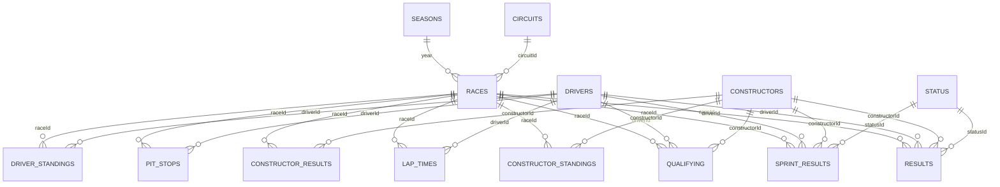

# Sector 4 — Data Report

**Phase:** 1 (Kaggle dataset analysis) · **Generated:** 2026-09-21
**Source under analysis:** Kaggle "Formula 1 World Championship (1950-2024)" (Vopani) — an Ergast API dump, files dated 2025-01-29.

---

## Summary

The Kaggle dump is **in much better shape than expected**. Three headline findings:

1. **2024 is complete, not cut off.** All 24 rounds are present in every table, ending with the Abu Dhabi Grand Prix on 2024-12-08. The final 2024 driver and constructor standings match [formula1.com](https://www.formula1.com/en/results/2024/drivers) **exactly** — all 24 drivers and all 10 teams, positions and points. So the "last updated ~2 years ago" note on the Kaggle page reflects the upload date, not truncated content.
2. **Structural integrity is perfect.** Every primary key is unique, **zero** foreign keys are orphaned across all 23 relationships, there are no duplicate `(year, round)` pairs, no gaps in round numbering in any season, and no race without results.
3. **Standings reconcile exactly for the modern era.** Recomputing driver standings from `results` + `sprint_results` reproduces `driver_standings` for **every one of the 14,398 snapshots from 1991 to 2024** with zero mismatches, and the `wins` column matches on all 34,863 rows across all eras. Pre-1991 mismatches are fully explained by the dropped-scores rule (confirmed empirically, not assumed). Every modern constructor discrepancy is a real championship penalty.

The gap to fill is therefore **not** 2024 — it is **2025 and 2026-to-date**, which are absent entirely. `seasons.csv` stops at 2024.

There are **8 genuine data issues**, all catalogued in [Issues](#issues-and-how-id-handle-each). Only one touches the modern era materially: a corrupted winner time in the 2024 Belgian Grand Prix. Nothing here required guessing or filling a value.

### Coverage at a glance

| Table | Rows | Seasons | Races covered | Last race present |
|---|---:|---|---:|---|
| `results` | 26,759 | 1950–2024 | 1,125 | 2024 R24 Abu Dhabi (2024-12-08) |
| `driver_standings` | 34,863 | 1950–2024 | 1,125 | 2024 R24 Abu Dhabi |
| `constructor_standings` | 13,391 | 1958–2024 | 1,061 | 2024 R24 Abu Dhabi |
| `constructor_results` | 12,625 | 1958–2024 | 1,060 | 2024 R24 Abu Dhabi |
| `qualifying` | 10,494 | 1994–2024 | 494 | 2024 R24 Abu Dhabi |
| `lap_times` | 589,081 | 1996–2024 | 544 | 2024 R24 Abu Dhabi |
| `pit_stops` | 11,371 | 2011–2024 | 285 | 2024 R24 Abu Dhabi |
| `sprint_results` | 360 | 2021–2024 | 18 | 2024 R23 Qatar (2024-12-01) |
| `races` | 1,125 | 1950–2024 | — | 2024 R24 Abu Dhabi |
| `seasons` | 75 | 1950–2024 | — | 2024 |
| `drivers` | 861 | — | — | — |
| `constructors` | 212 | — | — | — |
| `circuits` | 77 | — | — | — |
| `status` | 139 | — | — | — |

`sprint_results` ending at R23 is correct — Qatar was the last 2024 sprint; Abu Dhabi had none. All 18 scheduled sprints (2021–2024) have results, and there are no sprint results for races without a sprint.

---

## Table-by-table breakdown

Loaded with `\N` as the **only** null token (`keep_default_na=False`), so a genuinely empty field would stay visible as an empty string rather than silently becoming null. None were found.

### `races` — 1,125 × 18 · PK `raceId` ✅ unique
| Column | Dtype | Null % |
|---|---|---:|
| `raceId`, `year`, `round`, `circuitId` | int64 | 0.00 |
| `name`, `date`, `url` | str | 0.00 |
| `time` | str | 64.98 |
| `fp1_date`, `fp2_date`, `quali_date` | str | 92.00 |
| `fp1_time`, `fp2_time`, `quali_time` | str | 93.96 |
| `fp3_date` / `fp3_time` | str | 93.60 / 95.29 |
| `sprint_date` / `sprint_time` | str | 98.40 / 98.67 |

Session date/time columns only populate from 2021 onward. `date` is the local race date; `time` is the UTC start time (Ergast convention — **to be re-confirmed against the Jolpica docs in Part 2 rather than assumed**).

### `results` — 26,759 × 18 · PK `resultId` ✅ unique
| Column | Dtype | Null % | Note |
|---|---|---:|---|
| `resultId`, `raceId`, `driverId`, `constructorId`, `grid`, `positionOrder`, `laps`, `statusId` | int64 | 0.00 | |
| `points` | float64 | 0.00 | |
| `positionText` | str | 0.00 | always populated |
| `position` | float64 | **40.93** | null ⇔ not in the official classification |
| `number` | float64 | 0.02 | 6 rows |
| `time` / `milliseconds` | str / float64 | 71.30 | only classified finishers on the lead lap |
| `fastestLap`, `fastestLapTime`, `fastestLapSpeed` | — | 69.16 | 2004+ only |
| `rank` | float64 | 68.20 | |

⚠️ **`(raceId, driverId)` is NOT unique** — 176 rows across 42 races share one (shared drives, 1950–1964, plus one 1978 oddity). Any join on that pair will fan out. Use `resultId`.

### `driver_standings` — 34,863 × 7 · PK `driverStandingsId` ✅ unique
No nulls in any column. Cumulative snapshot **after** each race (see [Leakage](#leakage-warning-for-modelling)).

### `constructor_standings` — 13,391 × 7 · PK `constructorStandingsId` ✅ unique
No nulls. Same post-race snapshot semantics.

### `constructor_results` — 12,625 × 5 · PK `constructorResultsId` ✅ unique
`status` is 99.87% null; the 17 non-null values are all `"D"` and all 2007 McLaren (spygate). Points scored **on track**, before championship penalties.

### `lap_times` — 589,081 × 6 · PK `(raceId, driverId, lap)` ✅ unique
No nulls anywhere. `time` and `milliseconds` agree on **every single row** (max difference 0 ms).

### `pit_stops` — 11,371 × 7 · PK `(raceId, driverId, stop)` ✅ unique
No nulls. `duration` and `milliseconds` agree exactly on all rows.

### `qualifying` — 10,494 × 9 · PK `qualifyId` ✅ unique
`q1` 1.49% null, `q2` 44.07%, `q3` 64.98% — expected, since only 15 and 10 drivers reach Q2/Q3 in the knockout era.

### `sprint_results` — 360 × 16 · PK `resultId` ✅ unique
`position` 4.17% null, `time`/`milliseconds` 5.56%, `fastestLap`/`fastestLapTime` 2.50%.

### `drivers` — 861 × 9 · PK `driverId` ✅ unique
`number` 93.15% null and `code` 87.92% null — permanent numbers and three-letter codes only exist for the modern era. Not a defect.

### `constructors` — 212 × 5 · `circuits` — 77 × 9 · `seasons` — 75 × 2 · `status` — 139 × 2
All PKs unique, no nulls in any column of any of the four.

---

## Relationship diagram

**All 23 foreign-key relationships resolve with zero orphans.**

Three parent rows are never referenced (harmless, not errors):
- `constructors.constructorId = 88` — "Eagle", no `results` rows.
- `status.statusId = 133` (`+49 Laps`) and `134` (`+38 Laps`) — unused status codes.

---

## Consistency checks

### Driver standings recomputation
Recomputed as `sum(results.points) + sum(sprint_results.points)`, cumulative per round, against a dense driver × round grid (so a driver who skips a race keeps their running total).

| Scope | Snapshots | Mismatches |
|---|---:|---:|
| **1991–2024** | 14,398 | **0** ✅ |
| All eras (1950–2024) | 34,863 | 126 (0.36%) |
| End-of-season totals, all eras | 3,211 driver-seasons | 50 |
| `wins` column, all eras | 34,863 | **0** ✅ |

All 50 end-of-season mismatches are in one direction — the naive sum **exceeds** the official total, never falls short. That is the signature of dropped scores, and it is confirmed below rather than assumed.

### Constructor standings recomputation

| Scope | Snapshots | Mismatches |
|---|---:|---:|
| 1991–2024 | — | 25, all in 2007 / 2018 / 2020 (all explained) |
| All eras | 13,391 | 197 |
| `constructor_results` vs sum of `results.points` per team-race, **1980+** | — | **0** ✅ |
| Same check, 1950–1979 | — | 477 (best-car-only rule) |

### Rule quirks found, and how each was handled

| # | Quirk | Evidence found | Handling |
|---|---|---|---|
| 1 | **Dropped scores** (best N of M) | 50 driver-seasons over 1950–67, 1979–80, 1985–90; naive sum always ≥ official | **Confirmed empirically by fitting N**, not assumed. 1988 = best 11 of 16 (Prost 105→87, Senna 94→90 — the season Prost outscored Senna but lost the title); 1990 = best 11 of 16; 1950 = best 4 of 7. Recompute reported as-is with the delta attributed. |
| 2 | **Split-season dropped scores (1979)** | Best-N fits Scheckter (8) but **not** Villeneuve — no single N works | Correctly identified as the half-season rule (best 4 of first 7 + best 4 of last 8), which no single-N model can fit. Flagged, not forced. |
| 3 | **Shared drives** | 228 rows share a `(raceId, positionOrder)` across 46 races, 1950–64. Verified: in race 717 (1964 US GP) driver 373 appears at P7 in his own car **and** at P12 in a shared car | Points already split fractionally in `results.points`. No adjustment needed; documented as the reason `(raceId, driverId)` is not unique. |
| 4 | **Half-points races** | 42 fractional-point rows in exactly 1952–56, 1959, 1975, 1984, 1991, 2009, 2021 | Matches the known half-points races (1975 Spain, 1984 Monaco, 1991 Australia, 2009 Malaysia, 2021 Belgium). Already baked into `results.points`; no adjustment. |
| 5 | **Changing points systems** | — | **No reimplementation needed.** `results.points` stores the points actually awarded per race, so every era's table is already applied. This removes a large class of potential error. |
| 6 | **Fastest-lap bonus point** | — | Also already inside `results.points`. Confirmed by the exact 1991–2024 reconciliation, which spans the 2019–24 bonus-point era. |
| 7 | **Sprint points** | 360 rows, 2021–24, all 18 scheduled sprints | Added to the driver total at the same `raceId`. Reconciles exactly. |
| 8 | **Indy 500 excluded from the Constructors'** | Race 768 (1958 Indy 500) is the sole race in `constructor_standings` with no `constructor_results` rows | Correct behaviour: Indy counted for the Drivers' title 1950–60 but never the Constructors'. Standings carry forward; no constructor points awarded. Not an error. |
| 9 | **Constructors: best car only (pre-1979)** | 477 team-race mismatches, entirely 1950–1979, **zero from 1980 on** | Only the highest-finishing car scored before 1979. `constructor_results` is authoritative; don't derive it by summing `results` for those years. |
| 10 | **2007 McLaren exclusion** | 17 `constructor_results` rows flagged `status='D'` | Ergast places McLaren **last (P11)** but keeps `points = 218`; officially they scored **0**. Inconsistent with how 2018/2020 are handled — see Issue 2. |
| 11 | **2018 Force India** | `constructor_results` 111 vs standings 52 (Δ59) | Real: the team entered administration and forfeited its first-12-race points on re-entry as Racing Point. Ergast reuses one `constructorId` for both. Standings are correct. |
| 12 | **2020 Racing Point** | `constructor_results` 210 vs standings 195 (Δ15) | Real: 15-point deduction for the "pink Mercedes" brake ducts. Standings are correct. |

**Rule of thumb this establishes:** `constructor_results` = points scored on track; `constructor_standings` = championship points after penalties. They diverge in exactly 2007, 2018 and 2020 in the modern era. **Use `constructor_standings` as the championship truth.**

### Ground-truth spot check (2024)
Both verified against formula1.com, full tables, not spot values:
- **Drivers:** all 24 positions and point totals match exactly ✅
- **Constructors:** all 10 positions and point totals match exactly ✅

---

## Issues and how I'd handle each

| # | Severity | Issue | Scope | Proposed handling |
|---|---|---|---|---|
| 1 | **High** | **2024 Belgian GP winner time is corrupt.** Race 1134: Russell won on track then was disqualified for being underweight. Hamilton is classified P1 but his `time` is `+0.526` and `milliseconds` = **526** — a gap, not a total. Russell's row has `time` `1:19:57.040` (4,797,040 ms) but `milliseconds` = 4,797,566 — off by exactly Hamilton's 526 ms gap. | Exactly **1 race** of 1,125. The only race with no absolute winner time; the only absolute-time/ms disagreement in the entire table. | Ask you before touching it. Cleanest fix is to take Jolpica's version of this race in Part 3 and diff. **Do not** derive race-duration features without handling this row, or the 2024 Belgian GP will look like a 0.5-second race. |
| 2 | Medium | **2007 McLaren points inconsistency.** `constructor_standings` shows 218 points at P11; officially McLaren scored **0**. Ergast also applies a temporary 15-point deduction at rounds 11–13 that then disappears. | 1 constructor-season | Flag, don't silently rewrite. Recommend adding a derived `championship_points` column that applies the exclusion, keeping the raw value intact. **Needs your decision.** |
| 3 | Medium | **`results.laps` disagrees with `lap_times` row counts** for 92 driver-races (0.80% of the 11,496 in lap-times coverage). Includes clear **driver-ID swaps**: in race 155 (2001) driver 15 has `laps=0` but 52 lap-time rows while driver 55 has `laps=52` and none — the two are transposed. Same pattern in races 157 and 13. Worst years: 2014 (26), 2010 (19), 2001 (11), 2003 (11). One row in 2024. | 92 driver-races, 1998–2024 | Trust `results.laps` (it reconciles with standings); treat `lap_times` as suspect where they disagree. Diff the 2024 case against Jolpica in Part 3. Flag the rest; **do not** repair the swaps without your sign-off. |
| 4 | Low | **`(raceId, driverId)` not unique in `results`** — 176 rows, 42 races. 1950–64 are legitimate shared drives; the 1978 Italian GP has Harald Ertl entered twice under two different `constructorId`s, both DNQ. | 42 races | Document loudly; use `resultId` as the join key. The 1978 row is a genuine duplicate entry — flag for your call. |
| 5 | Low | **`grid` exceeds the number of classified entrants** for 13 rows (1952, 1953, 1964–67, 1969, 1971, 1985, 1986). | 13 rows | Almost certainly correct-as-recorded: grid slots came from a larger entry list where non-qualifiers were dropped from results. Leave as-is, document. |
| 6 | Low | **`grid = 0` on 1,638 rows** — Ergast's encoding for a pit-lane start or no qualifying time, not a missing value. | 1,638 rows | Not a defect. Must be decoded explicitly before use as a numeric feature, or a pit-lane start will read as pole. |
| 7 | Low | **Red-flag periods recorded as lap times and pit stops.** 626 lap times exceed 10 minutes (race 847, the 2011 Canadian GP, has 2:05:xx "laps" during its 2-hour suspension) and 478 pit stops exceed 5 minutes (race 1083 has ~51-minute lap-1 "stops"). | 626 + 478 rows | Not corruption — the clock keeps running under a red flag. Must be filtered before computing pace features. No pit stop is under 10 s, so there is no implausibly-fast corruption. |
| 8 | Low | **2005 Australian GP: `position` null with a numeric `positionText`** (Button P11, Sato P14). | 2 rows | **Verified as correct encoding**, not a bug: both were classified on track, then withdrawn so BAR could change engines without penalty. `position` = official classification, `positionText` = on-track result. Confirms the rule below. |

### Encoding rules confirmed
`position` is null **exactly** when the driver is not in the official classification. Verified: 0 rows have a non-numeric `positionText` with a non-null `position`, and 0 rows disagree where both are numeric. The 2 exceptions in Issue 8 are withdrawals and are correct.

| `positionText` | Rows | Meaning (dominant statuses) |
|---|---:|---|
| numeric | 15,808 | Classified |
| `R` | 8,897 | Retired (Engine 1,867; Accident 957; Collision 801) |
| `F` | 1,368 | Failed to qualify (DNQ 1,025; DNPQ 331; 107% rule 9) |
| `W` | 336 | Withdrew |
| `N` | 190 | Not classified (insufficient distance) |
| `D` | 151 | Disqualified |
| `E` | 9 | Excluded |

`positionOrder` is a dense 1..N rank in every race except the 46 shared-drive races, where it legitimately ties.

### Time-string parsing
| Field | Format | Agreement with `milliseconds` |
|---|---|---|
| `lap_times.time` | `M:SS.mmm`, and `H:MM:SS.mmm` under red flags | **Exact on all 589,081 rows** |
| `pit_stops.duration` | `SS.mmm` / `M:SS.mmm` | **Exact on all 11,371 rows** |
| `results.time` | `H:MM:SS.mmm` for the winner, `+S.mmm` / `+M:SS.mmm` for others | Exact on 1,124 of 1,125 races (Issue 1) |

⚠️ **`results.milliseconds` is the driver's total race time, not the gap** — confirmed on 6,545 of 6,553 `+gap` rows where `driver_ms − winner_ms` equals the stated gap to the millisecond. A parser must handle the hours component or it will fail on 43 red-flag lap times.

---

## Leakage warning for modelling

`driver_standings` and `constructor_standings` are **cumulative snapshots taken after each race**. The row for `raceId = R` contains the points total *including* race R's result.

**A model predicting race R must never read the standings row for race R.** Use round `R−1`, or recompute the pre-race total. Both standings tables reconcile exactly with a cumulative sum for 1991+, so the lagged version can be rebuilt with confidence.

The same applies to `results.points`, `positionOrder`, `laps`, `time`, `statusId` and every `fastestLap*` column — all are post-race outcomes. Legitimate pre-race features are `grid`, qualifying times, and anything lagged from earlier rounds.

---

## What is actually missing

| Gap | Detail |
|---|---|
| **2025 season** | Absent entirely — no `seasons` row, no races, no results. |
| **2026 season to date** | Absent entirely. 2026 was a full regulation reset (new cars, new power units, Audi and Cadillac entering), so it needs new `constructors` rows and likely new `drivers`. |
| New entities | Any driver, constructor or circuit debuting in 2025–26 is missing and will need a newly assigned integer ID. |

**2024 needs no backfill** — it is complete and verified. It will still be re-fetched from Jolpica so the overlap can be diffed, as planned.

Because 2026 is a regulation reset, pre-2026 car performance is a weak prior for 2026 pace. Worth carrying an explicit era flag into any model.
